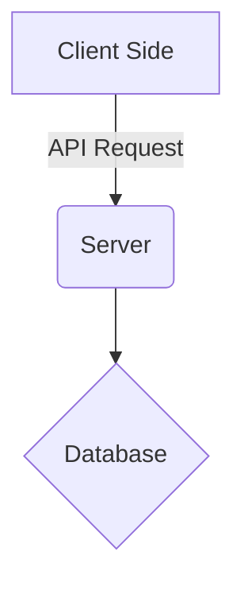
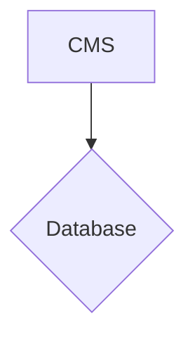

# Book a Crib

## Description

This is a hotel booking app from the CodeSpace curriculum. 
It is used to compare your selection of a hotel to other hotels. 
You can also create a booking which you can view on the bookings tab.

It includes being able to:

- Register and login to the client side
- Register and login to the server side for admin
- Compare hotels to each other
- Make a booking
___

___

___

## How to run

There is a dependencies folder with the database in that you will need to run the application. 
To run the client you must type <b>npm start<b/>.
To run the server you can serve it from your terminal using <b>php -S localhost:****<b/> or copy the server folder to your htdocs folder 
and host it via your AMP software.

## Usage

Upon launch of the application, you will first need to create an account where your details will be stored in the mySQL database
and login.
You will now have access to the application where you can select a hotel and follow the instructions to compare that hotel to other hotels.
You can then also create a booking.
___

You also have access to an admin console. There you can view the bookings, users and hotels. You are also able to create, update and delete
hotels if you wish.

The password to the admin is admin, and the email is admin@admin.com.
The password to the guest is guest, and the email is guest@guest.com.

### Disclaimer
Some areas of the application is slow to update, so don't worry if the booking does not immediately show.
Sometimes when the CMS is open alongside the client, bookings cannot be created.

### Credits 

This application is created by Dihan Vermeulen, you can see more of him at https://github.com/DihanVermeulen/.
